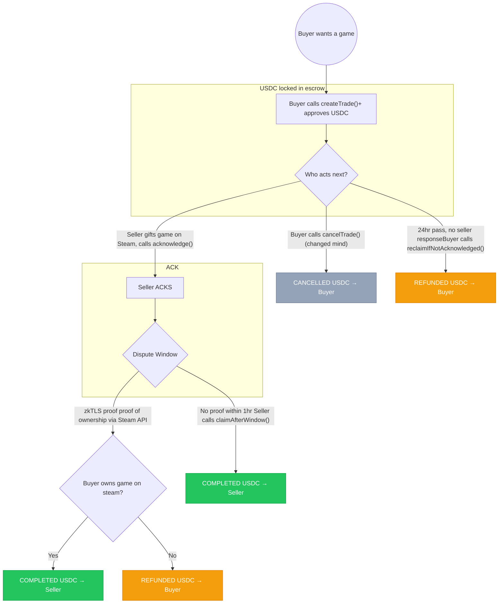

# Forage

A trustless Steam game marketplace using USDC on Monad with zkTLS proofs for game ownership verification.

## Architecture

- **contract/** - Solidity escrow contract (Foundry)
- **backend/** - Express.js API server
- **frontend/** - React marketplace UI
- **steam-zktls/** - Rust zkTLS prover/verifier for Steam game ownership

## Smart Contract Flow



## Prerequisites

- [Foundry](https://book.getfoundry.sh/getting-started/installation) (forge, anvil, cast)
- [Node.js](https://nodejs.org/) (v18+)
- [Rust](https://rustup.rs/) (for steam-zktls)
- MetaMask or compatible wallet

## Quick Start

### 1. Start Local Blockchain (Anvil)

```bash
./scripts/start-anvil.sh
```

This starts Anvil on `http://localhost:8545` with 10 pre-funded accounts.

### 2. Deploy Contracts

```bash
./scripts/deploy.sh
```

Deploys MockUSDC and SteamGameEscrow contracts. Note the contract addresses in the output.

### 3. Update Backend Config

After deployment, update `backend/src/config/contracts.json` with the deployed addresses:

```json
{
  "usdc": "0x...",
  "escrow": "0x...",
  "verifier": "0x..."
}
```

### 4. Start Backend

```bash
cd backend
npm install
npm run dev
```

Backend runs on `http://localhost:3001`.

### 5. Start Frontend

```bash
cd frontend
npm install
npm run dev
```

Frontend runs on `http://localhost:5173`.

### All-in-One (Optional)

```bash
./scripts/start-all.sh
```

Starts Anvil, deploys contracts, and runs both backend and frontend.

## Testing the Flow

1. **Add Anvil network to MetaMask:**
   - RPC URL: `http://localhost:8545`
   - Chain ID: `31337`
   - Currency: ETH

2. **Import a test account** using one of the private keys from Anvil output

3. **Create a listing** (Seller Dashboard):
   - Connect wallet
   - Click "Create Listing"
   - Enter price and Steam App ID (e.g., 730 for CS2)

4. **Purchase a game** (Marketplace):
   - Switch to a different account
   - Browse listings and click to purchase
   - Enter your Steam username
   - Approve USDC and confirm purchase

5. **Complete the sale** (Seller Dashboard):
   - Acknowledge the sale
   - Either wait for dispute window (1 hour) and claim, or prove ownership immediately

## Contract Addresses (Local)

After running `./scripts/deploy.sh`:

| Contract | Address |
|----------|---------|
| MockUSDC | `0x5FbDB2315678afecb367f032d93F642f64180aa3` |
| SteamGameEscrow | `0xe7f1725E7734CE288F8367e1Bb143E90bb3F0512` |
| Verifier | `0xf39Fd6e51aad88F6F4ce6aB8827279cffFb92266` |

## Test Accounts (Anvil)

Accounts 1-4 are pre-funded with 10,000 USDC each:

| Account | Address | Private Key |
|---------|---------|-------------|
| 1 | `0x70997970C51812dc3A010C7d01b50e0d17dc79C8` | `0x59c6995e998f97a5a0044966f0945389dc9e86dae88c7a8412f4603b6b78690d` |
| 2 | `0x3C44CdDdB6a900fa2b585dd299e03d12FA4293BC` | `0x5de4111afa1a4b94908f83103eb1f1706367c2e68ca870fc3fb9a804cdab365a` |
| 3 | `0x90F79bf6EB2c4f870365E785982E1f101E93b906` | `0x7c852118294e51e653712a81e05800f419141751be58f605c371e15141b007a6` |
| 4 | `0x15d34AAf54267DB7D7c367839AAf71A00a2C6A65` | `0x47e179ec197488593b187f80a00eb0da91f1b9d0b13f8733639f19c30a34926a` |

## API Endpoints

| Endpoint | Method | Description |
|----------|--------|-------------|
| `/health` | GET | Health check |
| `/api/config` | GET | Contract addresses and chain config |
| `/api/config/balance/:address` | GET | USDC balance for address |
| `/api/listings` | GET | All open listings |
| `/api/listings/:id` | GET | Single listing details |
| `/api/listings/address/:address` | GET | Listings by seller/buyer address |
| `/api/verifier/submit-proof` | POST | Submit zkTLS proof result |
| `/api/verifier/verify` | POST | Trigger verification (TODO) |

## Scripts

| Script | Description |
|--------|-------------|
| `scripts/start-anvil.sh` | Start local Anvil blockchain |
| `scripts/deploy.sh` | Deploy contracts to Anvil |
| `scripts/start-all.sh` | Start all services (local) |
| `scripts/deploy-monad.sh` | Deploy contracts to Monad Testnet |
| `scripts/start-monad.sh` | Start all services (Monad Testnet) |

## Development

### Fast-forward time (for testing dispute window)

```bash
cast rpc evm_increaseTime 3601 --rpc-url http://localhost:8545
cast rpc evm_mine --rpc-url http://localhost:8545
```

### Send test tokens to an address

```bash
# Send ETH
cast send <ADDRESS> --value 100ether --rpc-url http://localhost:8545 --private-key 0xac0974bec39a17e36ba4a6b4d238ff944bacb478cbed5efcae784d7bf4f2ff80

# Mint USDC
cast send 0x5FbDB2315678afecb367f032d93F642f64180aa3 "mint(address,uint256)" <ADDRESS> 10000000000 --rpc-url http://localhost:8545 --private-key 0xac0974bec39a17e36ba4a6b4d238ff944bacb478cbed5efcae784d7bf4f2ff80
```

## Monad Testnet Deployment

Deploy and run Forage on Monad Testnet instead of local Anvil.

### Network Details

| Property | Value |
|----------|-------|
| Chain ID | `10143` |
| RPC URL | `https://testnet-rpc.monad.xyz` |
| Explorer | `https://testnet.monadexplorer.com` |
| Currency | MON |

### Prerequisites

1. Get MON tokens for gas from the Monad testnet faucet
2. Have a funded wallet with its private key

### 1. Deploy Contracts

```bash
PRIVATE_KEY=0x... ./scripts/deploy-monad.sh
```

This deploys MockUSDC, SteamGameEscrow, SteamOwnershipVerifier, and SteamGameVerifier to Monad Testnet.

### 2. Update Backend Config

After deployment, update `backend/src/config/contracts.json` with the deployed addresses from the script output:

```json
{
  "usdc": "0x...",
  "escrow": "0x...",
  "verifier": "0x...",
  "ownershipVerifier": "0x..."
}
```

### 3. Start Services

```bash
VERIFIER_PRIVATE_KEY=0x... ./scripts/start-monad.sh
```

This starts:
- TLSNotary server on `http://localhost:7047`
- Backend on `http://localhost:3001`
- Frontend on `http://localhost:5173`

### 4. Connect MetaMask

The frontend will automatically prompt to add Monad Testnet to MetaMask when you connect. Alternatively, add it manually:

- Network Name: `Monad Testnet`
- RPC URL: `https://testnet-rpc.monad.xyz`
- Chain ID: `10143`
- Currency Symbol: `MON`
- Explorer: `https://testnet.monadexplorer.com`

### Logs

Service logs are available at:
- Notary: `/tmp/notary.log`
- Backend: `/tmp/backend.log`
- Frontend: `/tmp/frontend.log`
